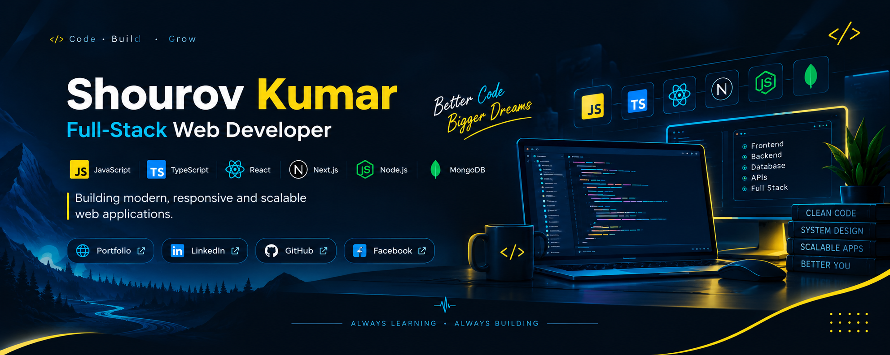

  

 

 

 &nbsp;  &nbsp;  &nbsp; 

  

# Hi, I'm Shourov Kumar 👋

### Full-Stack Web Developer | JavaScript • TypeScript • React • Next.js

I build modern, responsive, and user-focused web applications with a strong focus on clean code, reusable architecture, and practical problem solving.

My work is centered around the modern JavaScript ecosystem, covering frontend development, backend engineering, databases, APIs, and full-stack application development.

I enjoy turning ideas into useful digital experiences and continuously improving my skills through real-world projects, experimentation, and problem solving.

---

## 👨‍💻 About Me

- 💻 Full-Stack Web Development
- ⚛️ React & modern frontend development
- ▲ Next.js & full-stack applications
- 🟦 TypeScript for scalable JavaScript applications
- 🟢 Node.js & Express.js backend development
- 🍃 MongoDB & database-driven applications
- 🔌 REST API development and integration
- 🎨 Responsive UI/UX implementation
- 🧠 Problem solving, debugging & clean code
- 🚀 Interested in modern web technologies and software architecture

---

# 🛠️ Tech Stack

## 💻 Languages

  
  
  
  

## ⚛️ Frontend

  
  
  
  

## 🧩 Backend

  
  

## 🗄️ Database

  

## 🔧 Tools & Development

  
  
  
  

---

🔥 Contribution Streak

---

🤝 Let's Connect

   

 

📩 Email: dev.shourovkumar@gmail.com

💼 Open to: Freelance Web Development • Collaboration • Full-Stack Opportunities

Build • Learn • Improve • Repeat

Thanks for visiting my GitHub profile.

